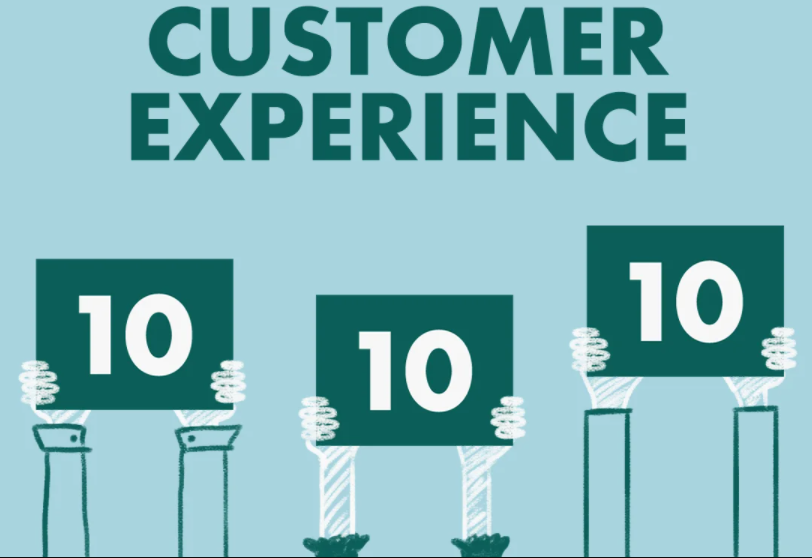

Dies ist ein Marketingbegriff. Customer Experience (CX) ist die Summe der Erfahrungen des Käufers mit einem Unternehmen oder auch einer Marke. Die Erfahrungen ergeben sich aus der positiven oder negativen Bewertung, die der Kunde an den verschiedenen Kontaktpunkten (Touchpoints) während der Customer Journey sammelt. Eine erfolgreiche Customer Experience zeichnet sich dadurch aus, dass der Kunde eine Wiederholung anstrebt und das Unternehmen weiterempfehlt.

# Warum ist Customer_Experience unverzichtbar & essenziell:

Customer_Experience ist so bedeutungsvoll, weil sie enormes Einfluss auf das Geschäftsergebnis vom Unternehmen hat. Deswegen ist es für das Unternehmen eine große Kampfansage, in einem wettbewerbsintensiven Geschäftsumfeld Käufern zu gewinnen. 
Es ist eine echte Herausforderung, in einem wettbewerbsintensiven Geschäftsumfeld Kunden zu gewinnen und zu binden. Unternehmen, die den Aspekt einer nahtlosen und effektiven Customer Experience ignorieren, ziehen den Kürzeren gegenüber Firmen, die wissen, dass der Kunde im Mittelpunkt ihres Handelns steht.[^1].
Im Laufe der Zeit gewinnt CX immer mehr an Bedeutung, wie eine Studie des Beratungsunternehmens Walker belegt, dass CX ab 2020 zum wichtigsten Markenkriterium geworden ist, und damit wichtiger als Preise oder auch Produkte.[^2]

 

* Perfekte Customer Experience [^3]

# Teilbereiche der Customer Experience:
Customer Experience ist kein isoliertes Ereignis, das an einem bestimmten Ort und zu einer bestimmten Zeit auftritt

# Wie wird CX von erfolgreichen Unternehmen umgesetzt?
Die Unternehmen verfolgen mehrere Methoden, um Customer_Experience zu verwirklichen. Das Marketing besteht auf drei unverzichtbaren Bestandteilen, und zwar:  Einfachheit, Effektivität und Empathie beziehungsweise Emotion, diese Komponenten machen die Customer_Experience im Wesentlichen aus.

Das wichtige Prinzip von Customer_Experience liegt daran, dass die Probleme direkt vom Unternehmen gelöst werden und sie lieber ohne Zeitverzögerung zu den Produkten bzw. Dienstleistung für den Kunden zu leiten. Nachdem das Unternehmen diesen Grundlagen erfüllt, ist es dann möglich den Kunden mit extra zusätzlichen Leistungen z.B. Sonderrabatte oder andere Vergünstigung zu begeistern und dementsprechend sich an das Unternehmen stärkere binden.

„Die Customer Experience umfasst jede einzelne Interaktion eines Kunden mit einem Unternehmen, in jeder einzelnen Phase der Customer Journey, darunter das Marketingmaterial, das er sieht, ehe er Kunde wird, das Verkaufserlebnis, die Qualität des Produkts und der Kundenservice im Anschluss an den Kauf.“, sagt Dave Dyson, Senior Customer Service Evangelist, Zendesk

# Welche Hauptziele sind bei Customer_Experience zu erlangen:
* Die Wünsche und Erwartungen von Kunden sind im Mittelpunkt.
* Schnelle und einfache Problemlösungen spielen eine große Rolle bei den Kunden.
* Die Kundenerlebnisse müssen vom Unternehmen optimiert sein.
* Feedback muss effizient ausgewertet und bearbeitet werden. 

# Langfristige Ziele?
* Langfristig entsteht den Effekt der Markentreue und Loyalität. Das stehen die Unternehmen vor die Probleme, durch Kommunikation mit den Kunden oder auch potenziellen Käufern deren Erwartungen und Wünsche in Erfahrung zu bringen.
* Die künstliche Intelligenz wird Customer Experience Management in die Zukunft durchführen, mit der großen Hilfe das maschinelle Lernen wird es erleichtert. Information über die Kunden werden gesammelt, somit lernt Kl mit zunehmenden Angaben, wie sie die CX für jeden Kunden verbessern kann.[^2]

# Geschichte:
* Der CEM von Pine Gilmore (1998) hat es bei einem Artikel für Harvard Business Review. Später gelinge es starken Firmen, der Käufer aus möglichst authentischen Erfahrungen mit dem Anbieter persönliche Mehrwerte ableiten.
* Der Expert Thompson Kolsky (2004), der bei Beratungsunternehmen Gartner gearbeitet hat, hat schon sehr früh geahnt, wie zunehmende Rolle die Customer_Experience in das Marketing, als langfristigen Erfolg für die Firmen.
* Im Jahr 2008 äußerte Jessica Debor, dass durch effiziente Customer_Experience-Management, die Fähigkeit von Unternehmen zu setzen, um positive Meinungen von Kunden zu schaffen, steigert die Kaufbereitschaft und auch die Loyalität zum Unternehmen bzw. Marke [^3]

# Weiterführende Literatur

* Die Treiber von der Customer_Experience von Andreas Toth. https://books.google.de/books?hl=de&lr=&id=k8GPDwAAQBAJ&oi=fnd&pg=PP5&dq=buch+customer+experience&ots=hc3lthO_OR&sig=5ssR13WedV1_esUxMSSYgXYf5bY#v=onepage&q=buch%20customer%20experience&f=false

# Quellen

[^1]: https://www.zendesk.de/blog/why-companies-should-invest-in-the-customer-experience-2/

[^2]: https://blog.usu.com/de-de/die-perfekte-customer-experience-schaffen-2020

[^3]: https://blog.usu.com/de-de/die-perfekte-customer-experience-schaffen-2020
*  https://www.zendesk.de/blog/why-companies-should-invest-in-the-customer-experience-2/
*  https://www.sem-deutschland.de/online-marketing-glossar/customer-experience/#Was_bedeutet_Customer_Experience
*  https://job-wizards.com/de/customer-experience-management-wie-kundinnen-und-kunden-gluecklich-werden-und-bleiben/

