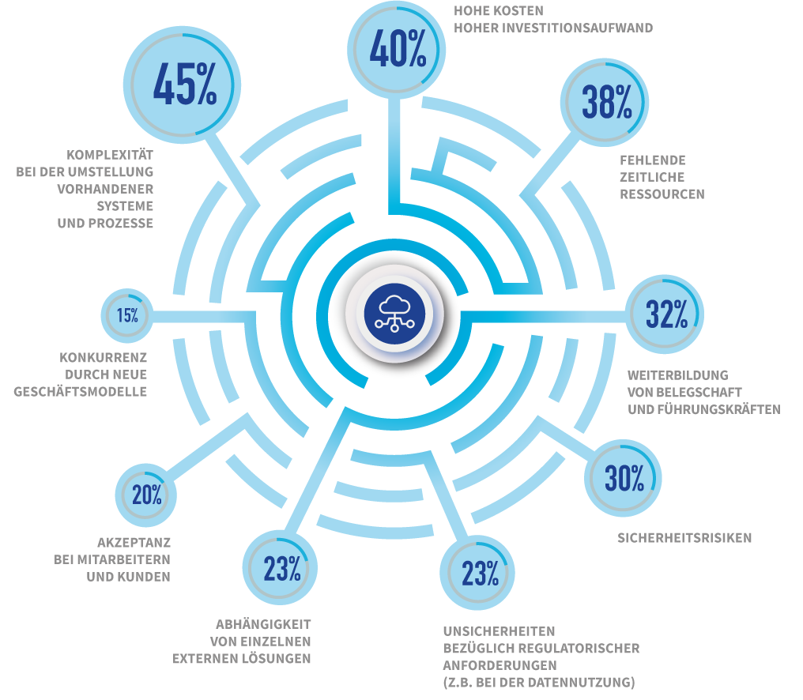

Der Begriff „Digitalisierung“ hat an sich keine allgemeingültige Definition und kann abhängig vom jeweiligen Kontext mehrere Bedeutungen haben.[^1] 
In Bezug auf das [Projektmanagement](Projektmanagement.md) bedeutet Digitalisierung „massive Veränderungen bei den Prozessen, der Kommunikation, der Organisation, dem [Ressourcenmanagement](Ressourcenplanung.md) und dem Monitoring. Gründe [dafür] sind der vermehrte Einsatz digitaler Werkzeuge sowie die neue Art der Erfassung, des Austausches und der Verarbeitung von Daten.“[^2] 

# Inhaltsverzeichnis 

1. [Grundlegende Aspekte der Digitalisierung im Projektmanagement](#Grundlegende-Aspekte-der-Digitalisierung-im-Projektmanagement)  
1.1. [Datenmanagement](#Datenmanagement)                                                                                                 
1.2. [Kommunikation](#Kommunikation)
2. [Potenziale](#Potenziale)
3. [Herausforderungen](#Herausforderungen)
4. [Fazit](#Fazit)
5. [Siehe auch](#Siehe-auch)
6. [Weiterführende Literatur](#Weiterführende-Literatur)
7. [Quellen](#Quellen)

# Grundlegende Aspekte der Digitalisierung im Projektmanagement

Der wesentlichste Aspekt ist die Nutzung von digitalen Arbeitsgeräten, wie Smartphones und Computer.[^3]                                            
Ein weiterer zentraler Aspekt ist der Einsatz digitaler Werkzeuge, welche die Arbeit in [Projekten](Projekt.md) erleichtern und effizienter gestalten sollen.  

## Datenmanagement 

Die Nutzung von Plattformen, wie [Asana](Asana_PM_Tool.md), [Microsoft Projekt](Microsoft_Project_PM_Tool.md) oder [Trello](Trello_PM_Tool.md), helfen die immer komplexeren Prozesse und Projekte zu bewältigen.[^3] In Verbindung mit zahlreichen [Projektmanagementsoftware](Projektmanagementsoftware.md) und [Cloud Services](Cloud_Services.md) können Informationen viel leichter ausgetauscht und miteinander geteilt werden. So wird ein immer aktueller Projektüberblick sowie Status der Aktivitäten ermöglicht.[^4] 
„Digitale Visualisierungs-Tools erlauben es zudem dem Projektverantwortlichen, unterschiedliche Szenarien visuell darzustellen […] Dadurch werden Projekte für alle Beteiligten transparenter und die organisatorischen Abläufe können einfacher und übersichtlicher gestaltet werden.“[^5] 

## Kommunikation

Ein weiterer Bereich, wo digitale Tools zum Einsatz kommen, ist die Kommunikation, die einen wichtigen Erfolgsfaktor im Projektmanagement darstellt.[^4] 
Die altbewährte E-Mail reicht für eine gelungene Zusammenarbeit nicht mehr aus. Dagegen erlauben Messanger-Dienste sich in Echtzeit zu vernetzten[^6] und Online-Meeting Tools, wie Zoom oder Skype, schaffen „neue flexible Möglichkeiten für alle Beteiligten, Besprechungen effizienter zu organisieren, [...].“ Das hat den Vorteil, dass Meetings häufiger virtuell stattfinden und so räumliche Distanzen leichter überbrückt werden können,[^4] was sich im Rahmen der Covid-19 Krise als essenziell erwiesen hat[^6]                      
                
# Potenziale

Mit der Effizienz, die durch einen gezielten Tooleinsatz gewonnen wird, wird die Produktivität der Teams gesteigert und es entsteht ein großes Potenzial darin, „eine Vielzahl von Projekten zeitgleich durchzuführen und trotzdem stets den Überblick zu behalten.“[^7] Zudem können durch die bessere Analyse von Daten und Gebrauch von Monitoring-Software Probleme und Risiken schneller identifiziert werden. Demnach können Projektmitglieder schneller reagieren, wodurch ein effizienterer Einsatz von Ressourcen und Budget erreicht und Kosten reduziert werden können.[^4] Ebenfalls werden viele klassische Aufgaben von Projektmanagern, wie beispielsweise [Zeitplanung](Zeitplanung.md), automatisiert. Die daraus resultierende Zeitersparnis bedeutet für den Projektmanager, dass er sich auf die wichtigeren Aufgaben im Projekt konzentrieren kann.[^6] Ein weiteres Potenzial besteht darin, dass auch externe Partner mit Hilfe von PM- und Kommunikations-Tools viel leichter in Projekte eingebunden werden können.[^5]

# Herausforderungen

Das Projektmanagement muss sich „auf mehr Geschwindigkeit und eine höhere Komplexität einstellen.“ Das bedeutet u.a., dass dezentrale und flexible Lösungswege, sowie agile Ansätze sich als wichtig erweisen werden. Aus diesem Grund werden vor allem Unternehmen, die bis jetzt ausschließlich auf klassische Methoden gesetzt haben, vor einer großen Herausforderung stehen.[^2] Bei einer großen Anzahl an Projekten kann zudem der Überblick schnell verloren gehen, weswegen die Schlüsselprojekte und Kernaufgaben von den jeweiligen Projekten definiert und Prioritäten gekonnt gesetzt werden müssen.[^7] Außerdem ändern sich die Anforderungen an die Kompetenzprofile von [Projektleitern](Projektleiter.md) und allen weiteren Teammitgliedern. Einerseits müssen sie bestimmte fachliche Qualifikationen mitbringen, aber auch Flexibilität und kommunikative Fähigkeiten sind gefragt.[^7] Letztendlich ist es wichtig, dass Unternehmen generell eine gute digitale Struktur schaffen, welche ein modernes und effizientes Projektmanagement ermöglicht. Dabei stehen die Unternehmen wiederum vor anderen Hürden. Die Abbildung zeigt, was genau die Unternehmen im Rahmen der „Digitalisierungsumfrage 2021“ als Herausforderungen aufgeführt haben.[^8]

*Unternehmerische Herausforderungen bei der Digitalisierung*[^8]

# Fazit

Das Voranschreiten der Digitalisierung hat viele Veränderungen für das Projektmanagement und alle Beteiligten gebracht. Um aber auch in der Zukunft weiterhin erfolgreich zu sein, wird sich das Projektmanagement weiterentwickeln und an neue Trends anpassen müssen. Ein Thema, welches dabei sicherlich eine große Rolle spielen wird, ist die [Künstliche Intelligenz (KI)](KI_im_PM.md) und das damit verbundene [Maschinelle Lernen](Machine_Learning_im_Projektmanagement.md).[^9] Denn von vielen Unternehmen wird die KI als die wichtigste Zukunftstechnologie gesehen und wird, vor allem in größeren Unternehmen, schon eingesetzt.[^8]

# Siehe auch

* [Digitale Kommunikation](Digitale_Kommunikation.md) 
* [KI im Projektmanagement](KI_im_PM.md)
* [Projektmanagement 4.0](Projektmanagement_4_0.md)
* [Projektmanagementsoftware](Projektmanagementsoftware.md)

# Weiterführende Literatur

* [Webinar - Projektmanagement in Zeiten der Digitalisierung](https://www.alasco.de/blog/projektmanagement-in-zeiten-der-digitalisierung-webinar-1/)
* [Interview mit Projektmanagement-Experten Thomas Brunschede](https://www.it-daily.net/it-management/projekt-personal/22897-digitalisierung-im-projektmanagement)

# Quellen

[^1]: https://www.bigdata-insider.de/was-ist-digitalisierung-a-626489/  
[^2]: https://www.projektassistenz-blog.de/digitalisierung-neue-heraus-forderungen-fuer-das-projekt-management/
[^3]: https://360kompakt.de/management/projektmanagement-digitalisierung/
[^4]: https://www.management-circle.de/blog/digitalisierung-im-projektmanagement-was-sich-im-projektalltag-aendern-wird/
[^5]: https://executiveacademy.at/de/news/detail/die-kunst-des-digitalen-projektmanagements
[^6]: https://smallbiztrends.com/2021/06/digital-transformation-project-management.html
[^7]: https://www.arksolutions.de/themen/digitalisierung-im-projektmanagement/
[^8]: https://www.dihk.de/resource/blob/35410/e090fdfd44f3ced7d374ac3e17ae2599/ihk-digitalisierungsumfrage-2021-data.pdf
[^9]: https://www.factro.de/blog/digitales-projektmanagement/#ausblick
