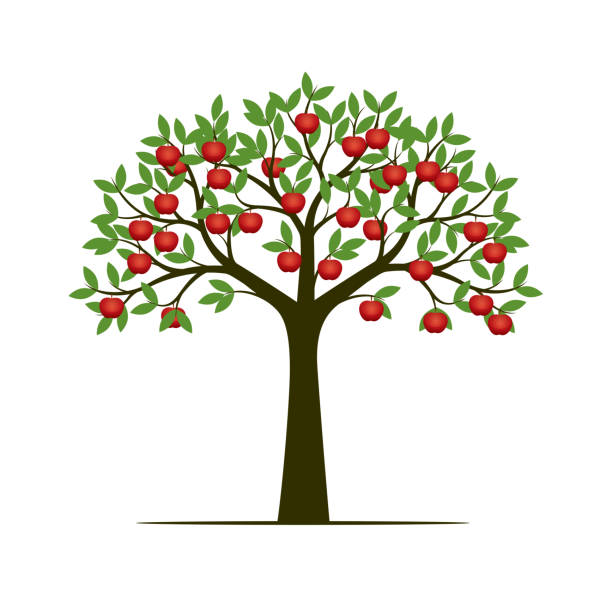
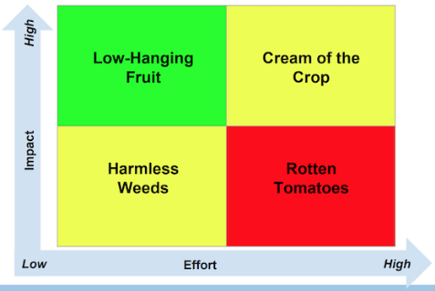

# Low Hanging Fruits

Low Hanging Fruits - zu Deutsch "niedrig hängende Früchte"- bezeichnet Aufgaben, welche mit minimalem Aufwand einen maximalen Ertrag erzielen. Metaphorisch sind es die niedrig hängenden Obststücke, welche man besonders einfach und ohne große Mühe von einem Baum pflücken kann. Hoch hängende Früchte sind dagegen schwerer zu erreichen und mit zusätzlichen Aufwänden oder Kosten verbunden. So würde man beispielsweise erst eine Leiter benötigen, um diese pflücken zu können.
Low Hanging Fruits haben somit ein überdurchschnittlich hohes Kosten-Nutzen-Verhältnis[^1] 

*Abbildung eines Baumes mit hängenden Äpfeln*[^5]

# Low Hanging Fruits in der Betriebswirtschaft

Der Begriff Low Hanging Fruits wird zumeist im Business-Bereich benutzt und beschreibt dort jene Aufgaben, die mit wenig Aufwand verhältnismäßig viel Umsatz generieren. Die Low Hanging Fruits können sich von Unternehmen zu Unternehmen relativ stark unterscheiden. Im Vertrieb beispielsweise gehören besonders so genannte Komplementärgüter zu den Low Hanging Fruits. Komplementärgüter sind dabei diejenigen Güter, die gemeinsam nachgefragt werden, weil sie sich in ihrem Nutzen ergänzen. Ein Handy-Händler bietet so neben dem Hauptprodukt, den Handys, noch Komplementärgüter wie etwa Schutzhüllen, Ladegeräte und Panzerfolien an[^2]. 
Der Smartphone-Hersteller Apple kündigte so im Oktober 2020 während einer  Keynote  an, dass zukünftige Smartphones ohne Netzteil und Kopfhörer ausgeliefert werden. Damit wechselte das iPhone-Netzteil von einem inkludierten Gut zu einem komplementärem Gut und somit zu einem neuen Low Hanging Fruit für Apple[^3].

# Die Low Hanging Fruit Matrix

Effektives und zielgerichtetes Arbeiten ist essentiell für den Erfolg von bestehenden [Projekten](https://github.com/jonaskarg187/ManagingProjectsSuccessfully.github.io/blob/main/kb/Projekt.md). Im Rahmen des [Projektmanagement](https://github.com/FCN478/ManagingProjectsSuccessfully.github.io/blob/main/kb/Projektmanagement.md) stellt besonders die Priorisierung bestimmter Aufgaben eine wichtige Herausforderung dar. Die Anzahl an Aufgaben zum Erreichen eines Projekts kann so überwältigend sein, dass es von großer Bedeutung ist diese sinnvoll nach Dringlichkeit, Aufwand und Ertrag zu ordnen. So garantiert man, dass besonders jene Aufgaben mit einem sehr guten Aufwand-Ertrags-Verhältnis zu erst erledigt werden. Diese Aufgaben stellen somit die Low Hanging Fruits im Projektmanagement dar und sorgen für einen besonders effektiven Projekteverlauf.
Das direkte Gegenteil dazu sind die so genannten "Rotten Tomatoes"- zu deutsch verfaulte Tomaten. Diese Aufgaben sind mit einem besonders hohen Aufwand verbunden, liefern jedoch einen verhältnismäßig kleinen Ertrag und somit vorerst direkt auszusortieren. 
  Neben den Low Hanging Fruits und Rotten Tomatoes auf beiden Extremen, gibt es noch die "Harmless Weeds" und die "Cream of the Crop" dazwischen.
Die Harmless Weeds stellen dabei Aufgaben mit wenig Aufwand aber auch wenig Ertrag dar. Aufgaben mit einem hohen Aufwand aber auch einem großen Ertrag werden als Cream of the Crop bezeichnet. 

*Low Hanging Fruit Matrix*[^6]

Da jedoch verschiedene Teammitglieder je nach Spezifizierungsbereich auch verschiedene Prioritäten haben ist es besonders wichtig die Kategorisierung der Aufgaben gemeinsam als Team vorzunehmen[^4]. Für eine effektive Aufgaben-Kategorisierung nach der Low Hanging Fruits Matrix, mit der alle Teammitglieder einigermaßen zufrieden sein sollte, ist folglich vorzugehen: 

1. Der Moderator/ Projektmanager führt ein Brainstorming-Gespräch über potenzielle Projekte mit dem Projektteam
2. Vergabe von Nummern für jedes mögliche Projekt 
3. Positionierung der Projekte in der Low Hanging Fruits Matrix anhand der zugeordneten Nummern
4. Abschließende Team-Diskussion über den Ergebnissen[^4]

# Siehe auch

* [Projekt](https://github.com/jonaskarg187/ManagingProjectsSuccessfully.github.io/blob/main/kb/Projekt.md)
* [Projektmanagement](https://github.com/FCN478/ManagingProjectsSuccessfully.github.io/blob/main/kb/Projektmanagement.md)

# Quellen

[^1]: [Was sind Low Hanging Fruits](https://www.advidera.com/glossar/low-hanging-fruits/)
[^2]: [Was ist Low Hanging Fruits?](https://www.onlinesolutionsgroup.de/blog/glossar/l/low-hanging-fruits/)
[^3]: [iPhone ohne Netzteil: Deshalb fühlen sich viele Nutzer abgezockt](https://www.maclife.de/news/iphone-ohne-netzteil-deshalb-fuehlen-sich-viele-nutzer-abgezockt-mac-life-100117824.html)
[^4]: [Low-Hanging Fruit Matrix - Lean Six Sigma for the Office](https://theleansixsigmaoffice.com/2017/03/18/low-hanging-fruit-matrix/)
[^5]: [Apfelbaum](https://www.istockphoto.com/de/grafiken/apfelbaum)
[^6]: [Abbildung Low Hanging Fruit Matrix](https://www.einstein1.net/low-hanging-fruits/)
