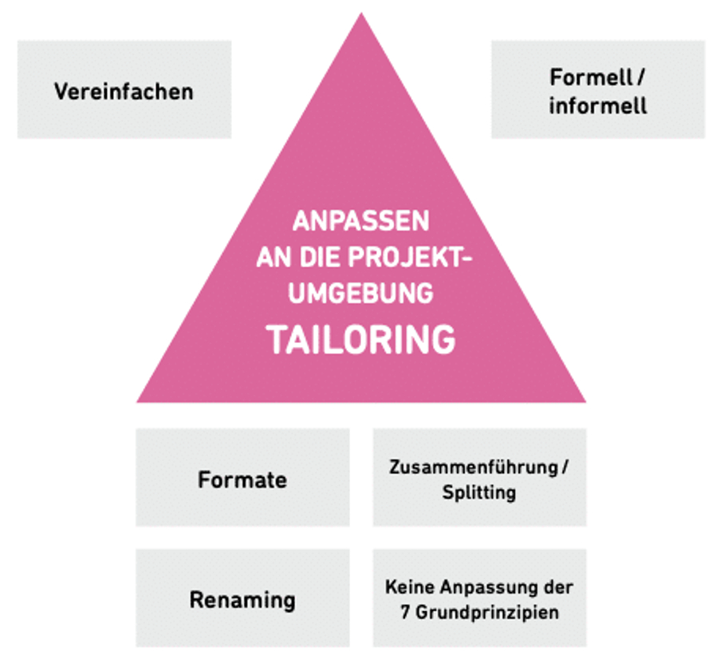

# Definition und Ziel
[PRINCE2](PRINCE2.md) steht für **PR**ojects **IN** **C**ontrolled **E**nvironments oder auch [Projekte](Projekt.md) in kontrollierten Umgebungen und ist eine auf Prozessen und [Best Practices](Best_Practices.md) basierende Methode für effektives [Projektmanagement](Projektmanagement.md) [^1][^2]. Im folgenden Beitrag soll daher die Projektumgebung von [PRINCE2](PRINCE2.md) näher betrachtet werden. Dazu wird zunächst kurz auf die Bestandteile des [PRINCE2](PRINCE2.md) Frameworks eingegangen und schließlich explizit auf die Projektumgebung. Abgerundet wird der Beitrag mit einem Fazit.

Für einen allerersten Überblick ist es zunächst empfehlenswert, den Beitrag [PRINCE2](PRINCE2.md) zu lesen. 

# Was sind die Bestandteile von PRINCE2?

 [^10]
*Die vier Bausteine von PRINCE2*

 [^11]
*Der Aufbau von PRINCE2* 

Die vier Bausteine von [PRINCE2](PRINCE2.md) sind also die:

> ## 1. [Sieben Grundprinzipien](PRINCE2_7_Grundprinzipien.md)
Die Grundprinzipien stellen feste Leitsätze dar und definieren die grundlegenden Regeln. Um ein PRINCE2-Projekt zu initiieren und zu managen ist jedes der sieben Grundprinzipien zu befolgen [^3]. Das Kompendium [Sieben Grundprinzipien](PRINCE2_7_Grundprinzipien.md) beschäftigt sich genauer mit der Thematik.

> ## 2. Sieben Themen
Sie beschreiben den Inhalt von [PRINCE2](PRINCE2.md) bzw. den Inhalt der richtigen Projektstruktur, also wie man eine richtige Projektorganisation erstellt oder wie Reportingstrukturen auszusehen haben. Das sind die Aspekte des Projektmanagements, die kontinuierlich behandelt werden müssen [^4]. 

> ## 3. [Sieben Prozesse](PRINCE2_7_Prozesse.md)
Sie stellen die Ablaufbeschreibung um die sieben Themen dar, also wann wer was im [Projekt](Projekt.md) macht. Sie beschreiben das schrittweise Vorgehen während dem Projekt [^3]. Nähere Informationen findet man im Beitrag [Sieben Prozesse](PRINCE2_7_Prozesse.md).

> ## 4. Anpassung an die Projektumgebung
In der PRINCE2 Terminologie ist die Anpassung an die Projektumgebung nicht sehr umfangreich beschrieben, dennoch stellt sie für den Projektmanager das größte Thema bei der Verwendung von [PRINCE2](PRINCE2.md) dar. Grund dafür ist, dass dieser Baustein vollkommen anpassbar ist und auf sämtliche [Projekte](Projekt.md) angewendet werden kann [^3]. Was genau unter einem [Projekt](Projekt.md) zu verstehen ist, kann man in der Verlinkung nachlesen. 

# PRINCE2 Projektumgebung

 
Wie bereits erwähnt kann als wichtigstes Grundprinzip von PRINCE2 die Anpassung (Tailoring) an die Projektumgebung genannt werden. Anpassung bezeichnet in diesem Fall die angemessene Anwendung von [PRINCE2](PRINCE2.md) auf ein bestimmtes [Projekt](Projekt.md). Dabei muss der Umfang von Planung und Steuerung sowie der Einsatz von Prozessen und Themen richtig auf das [Projekt](Projekt.md) abgestimmt werden. Nicht zu verwechseln ist die Anpassung mit dem Begriff der Integration, mit dem die reine Einführung (auch Embedding) von [PRINCE2](PRINCE2.md) in eine Organisation gemeint ist. Oft liegt die [Verantwortung](Verantwortlichkeiten.md) nicht zentral bei einer Person, sondern verteilt sich je nach Kompetenz auf mehrere [^5]. 
 

Die Anpassung an die Projektumgebung kann wie in der folgenden Abbildung [^6] erfolgen: 

*Anpassung an die Projektumgebung*

Zum einen können die Techniken/Praktiken vereinfacht werden. Es wird z.B. auf Dokumente und Berichte verzichtet. 
Zum anderen finden Meetings weniger formell, sondern auch mal beim Mittagessen statt. 
Formate werden aufgrund externer Anforderungen, wie Style-Guides, umgestaltet. 
Die Zusammenführung von einzelnen Berichten zu einem großen kann zu einer Verschlankung bei [Projekten](Projekt.md) führen. 
[PRINCE2](PRINCE2.md) gibt zwar klar definierte Rollen vor, z.B. wird ein Kunde im [Projekt](Projekt.md) als "Abnehmer" definiert. Es ist aber auch möglich, dass in [PRINCE2](PRINCE2.md) bestehende Rollen an die im Unternehmen etablierten Terminologien angepasst werden. Nicht angepasst werden hingegen die [sieben Grundprinzipien](PRINCE2_7_Grundprinzipien.md). 

[PRINCE2](PRINCE2.md) ermöglicht also für jedes Unternehmen bzw. teilweise sogar für jedes [Projekt](Projekt.md) eine individuelle Anpassung, um so optimal auf die spezifischen Anforderungen hinsichtlich Umgebung, Umfang, Komplexität, Wichtigkeit, Leistungsfähigkeit und Risiko eingehen zu können [^7]. 

[PRINCE2](PRINCE2.md) stellt eine flexible und leicht wiederholbare Anleitung zur Projektplanung dar. Der ursprüngliche Zweck war das Managen von [IT-Projekten](IT-Projekte.md), worauf es aber heutzutage nicht mehr beschränkt ist. Die Erweiterung wäre PRINCE2 agile, wobei es darum geht klassische Projekte mit agilen Methoden wie z.B. [Kanban](Kanban.md) oder [SCRUM](SCRUM.md) kombiniert werden [^8].  

# Fazit

[PRINCE2](PRINCE2.md) gilt als das "How To" des klassischen [Projektmanagements](Projektmanagement.md): Es ist flexibel, skalierbar und kann auf die spezifischen Anforderungen eines Unternehmens angepasst werden [^1]. [PRINCE2](PRINCE2.md) zählt zu den am häufigsten verwendeten [Projektmanagementmethoden](Projektmanagement.md) [^3]. Dank dieser Methode ist es möglich, jederzeit den Beginn, den Verlauf und den Abschluss von [Projekten](Projekt.md) zu kontrollieren. 
[PRINCE2](PRINCE2.md) lässt sich an nahezu jede Projektumgebung anpassen und erweist sich dadurch als äußerst flexibel. Da aber die [sieben Grundprinzipien](PRINCE2_7_Grundprinzipien.md) nicht angepasst werden, bleibt immer ein gewisser Rahmen für große und kleine Projekte bestehen, an dem man sich orientieren kann [^9].

# Siehe auch

* [Best_Practices](Best_Practices.md)
* [Business_Cases](Business_Cases.md)
* [Projekt](Projekt.md)
* [Projektmanagement](Projektmanagement.md)
* [Projektplanung](Projektplanung.md)
* [PRINCE2](PRINCE2.md) 
* [PRINCE2_7_Grundprinzipien](PRINCE2_7_Grundprinzipien.md)
* [PRINCE2_7_Prozesse](PRINCE2_7_Prozesse.md)
* [IT-Projekte](IT-Projekte.md)
* [KANBAN](Kanban.md)
* [SCRUM](SCRUM.md)
* [Risikomanagement](Risikomanagement.md)
* [Risikoanalyse_und_Visualisierung](Risikoanalyse_und_Visualisierung.md)

# Weiterführende Literatur

* [AXELOS. (2017). Managing Successful Projects with PRINCE2 6th Edition. UK: The Statinery Office.](https://www.hugendubel.de/de/ebook_epub/axelos-managing_successful_projects_with_prince2_2009_edition-20000486-produkt-details.html)

# Quellen

[^1]: [PRINCE2-Project-Management](https://www.axelos.com/certifications/propath/prince2-project-management) 
[^2]: [PRINCE2 Projektmanagementmethode von AXELOS](https://www.truecare.de/pm-qualifizierung/prince2/) 
[^3]: [Kaiser, F. & Simschek, R. (2020). PRINCE2: Die Erfolgsmethode einfach erklärt. Version 2017. München: UVK Verlag.](https://www.thalia.de/shop/home/artikeldetails/A1058324519?ProvID=11000522&gclid=EAIaIQobChMIlLeY_ab39AIVY41oCR1tBQeSEAQYAiABEgKXFfD_BwE)
[^4]: [PRINCE2-Methode-Definitionen](https://www.maxpert.de/de/profil/schulungsspektrum/prince2-methode-definitionen/506) 
[^5]: [High Performance Projekte mit PRINCE2](https://www.youtube.com/watch?v=zl4zHUtwmSg) 
[^6]: [PRINCE2 Projektumgebung](https://www.agile-heroes.de/magazine/prince2-projektumgebung/)
[^7]: [PRINCE2](https://de.wikipedia.org/wiki/PRINCE2)
[^8]: [Benefits and Issues in Managing Project by PRINCE2 Methodology (2017)](https://www.researchgate.net/publication/318555680_Benefits_and_Issues_in_Managing_Project_by_PRINCE2_Methodology) 
[^9]: [PRINCE2 Anpassung an die Projektumgebung](https://www.certnow.de/itsm-blog/10-prince2/77-prince2-2017-anpassen-an-die-projektumgebung.html)  
[^10]: [PRINCE2 Leitfaden](https://www.agile-heroes.de/magazine/prince2-leitfaden/) 
[^11]: [PRINCE2 Aufbau](https://www.heitcon3.de/wp-content/uploads/2019/08/PRINCE2-2017-Leseprobe.pdf) 

