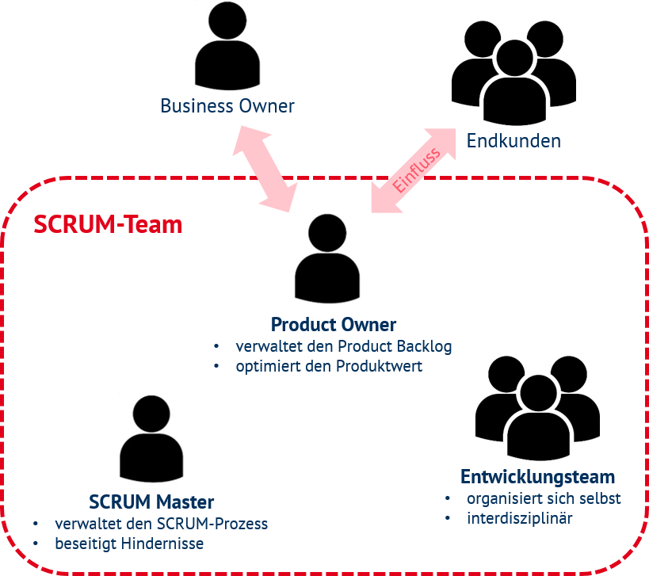

[SCRUM](SCRUM.md) ist ein Framework aus dem Bereich des agilen Projektmanagements und spezifiziert die handelnden Personen in verschiedene Kategorien. Grundsätzlich existieren drei verschiedene Rollen. Zum einen gibt es den Product Owner, dazu den Scrum Master und zuletzt das Development Team. Die jeweiligen Rollen besitzen je eigene Anforderungen, die sie in das Projekt miteinbringen müssen. Das Zusammenspiel aller handelnden Personen hat dabei oberste Priorität.[^1]

## Product Owner
Der [Product Owner](Product_Owner.md) ist eine einzelne Person und kann nicht aus einer Gruppe bestehen. Die zentrale Aufgabe dieser Position besteht darin, den Wert des Produkts, welches im Rahmen des jeweiligen SCRUM-Projekts bearbeitet wird, zu maximieren. Dabei ist diese Person ebenfalls für den Product Backlog zuständig, welcher eine Liste mit sämtlichen Anforderungen und Aufgaben eines Projekts ist. Dahingehend kümmert sich der Product Owner um eine klare und verständliche Struktur und verwaltet ebenfalls die Beiträge und die Beitragserstellung. Das Ziel dahinter ist es, die Arbeit des Development Teams zu optimieren und aufzuzeigen, woran gerade gearbeitet wird.[^1] [^2]

## SCRUM Master
Der [SCRUM Master](Scrum_Master.md) ist dafür zuständig, dass das gesamte Team das SCRUM Konzept hinsichtlich der Werte, Regeln und Theorien versteht und umsetzt. Dabei ist er ebenfalls eine einzelne Person und tritt nicht als Projektleiter auf. In seinen Aufgabenbereich fällt darüber hinaus, externen Akteuren den SCRUM Ablauf in seinem Projekt verständlich zu machen und ist somit Ansprechpartner für sämtliche Personen, die mit dem Projekt in Verbindung stehen. 

Im Rahmen seiner Tätigkeit unterstützt der SCRUM Master den Product Owner, dessen Aufgaben effizienter und verständlicher zu gestalten. So wirkt er beratend bei der Erstellung des Product Backlogs mit und sorgt für einen reibungslosen Ablauf sowie für die Vermeidung von [Rollenkonflikten](Rollenkonflikte.md).

Des Weiteren steht er auch mit dem Development Team in Kontakt. Er lehrt dem Team wichtige Eigenschaften zur Selbstorganisation und einer funktionsübergreifenden Zusammenarbeit. Dazu beseitigt er für das Team sämtliche Probleme, die einem reibungslosen Arbeitsablauf im Weg stehen und organisiert je nach Bedarf Meetings. In diesem Kontext lässt sich seine Rolle als Berater und Organisator beschreiben. 
Für die gesamte Organisation ist der SCRUM Master als empirischer Produktentwickler wichtig.[^1][^2][^3]

## Development Team
Das [Development Team](Development_Team.md) besteht aus den jeweiligen Spezialisten, die direkt am verwertbaren Endprodukt eines Projekts arbeiten. Die Zusammensetzung ist dabei projektbezogen, interdisziplinär und individuell. Eine Rollenunterscheidung oder beispielsweise eine Hierarchie innerhalb des Teams existieren im Rahmen von SCRUM nicht und grundsätzlich ist das Team dazu befähigt, selbstorganisiert zu arbeiten und zu planen. Dennoch ist das Team für den Output des Projekts verantwortlich und als Ganzes rechenschaftspflichtig. 
Die optimale Teamgröße richtet sich nach dem jeweiligen Projekt. Sehr kleine Teams setzen sich der Gefahr aus, nicht genügend Kapazität für die Entwicklung zu haben. Jedoch vereinfacht sich die Kommunikation. Zu große Teams führen zu einer höheren Komplexität und innerhalb der Gruppe und zu etwaigen unklaren Abläufen. Dahingehend befindet sich die Teamgröße in einem Spannungsfeld und muss möglichst passend bestimmt werden. In den meisten Fällen besteht das Team aus drei bis neun Mitgliedern.[^1][^2]

[EnergyBrainPool](https://blog.energybrainpool.com/wp-content/uploads/2020/07/Bild2.png)
# Siehe auch

* [SCRUM](SCRUM.md)
* [Product Owner](Product_Owner.md)
* [Scrum Master](Scrum_Master.md)
* [Development Team](Development_Team.md)
* [Rollenkonflikte](Rollenkonflikte.md)

# Weiterführende Literatur

* www.scrumguide.de

# Quellen

[^1]: Jeff Sutherland Ken Schwaber: Der Scrum Guide. (PDF) scrum.org (https://scrumguides.org/docs/scrumguide/v2017/2017-Scrum-Guide-German.pdf), aufgerufen am 21.11.2021
[^2]: Scrum-Rollen, scrumguide.de (https://scrumguide.de/scrum-rollen/), aufgerufen am 21.11.2021
[^3]: Scrum-Master, scrumguide.de (https://scrumguide.de/scrum-master/), aufgerufen am 21.11.2021
