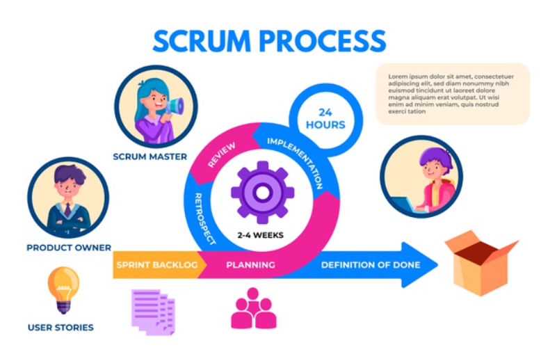

Um zu Beginn ein grobes Verständnis über den Scrum-Guide zu schaffen, soll zunächst eine Kurzbeschreibung folgen. Der Scrum-Guide ist ein Rahmenwerk für die Entwicklung, 
Bereitstellung und Aufrechterhaltung komplexer Produkte im Bereich der Softwareentwicklung.
Dieser Leitfaden enthält die Definition von Scrum, bestehend aus den Scrum-Rollen, Ereignissen, Artefakten und den Regeln, die sie miteinander verbinden. 
Ken Schwaber und Jeff Sutherland haben Scrum entwickelt. Der Scrum-Guide wurde von ihnen geschrieben und bereitgestellt, gemeinsam stehen sie hinter dem Scrum-Guide[^1]. 

# Der Scrum-Guide

Die wichtige Bedeutung von Scrum im agilen [Projektmanagement](Projektmanagement.md) ist unumstritten, so fallen die beiden Begriffe Scrum und agiles Projektmanagement häufig im gleichen Kontext. 
Es ist also wenig überraschend, dass Scrum der beliebteste agile Ansatz im Projektmanagement ist[^2]. Bevor der konkrete Scrum_Guide beschrieben wird, soll ein allgemeiner 
Überblick über Scrum gegeben werden. Was also genau ist Scrum?

Scrum ist ein Rahmenwerk, in dem Menschen komplexe, adaptive Probleme angehen und dabei produktiv und kreativ Produkte von größtmöglichem Wert liefern können.
Scrum hilft Menschen, Teams und Organisationen adaptive Lösungen für komplexe Probleme zu schaffen. Die Scrumgründer haben den Scrum Guide geschrieben, um Scrum klar und 
prägnant zu erklären. Dieser Leitfaden enthält die Definition von Scrum. Diese Definition besteht aus den Verantwortlichkeiten, Ereignissen, Artefakten und den Regeln, die Scrum 
miteinander verbinden[^3].

## Konkrete Inhalte des Scrum-Guides

Laut dem offiziellen Scrum-Guide aus dem Jahr 2020 enthält der Guide folgende Inhalte:

* Scrum-Definition 

*	Scrum-Theorie

*	[Scrum-Werte](Scrum_Values.md)

*	Scrum Team

*	Scrum Events 

*	[Scrum Artefakte](Scrum_Artefakte.md)

*	[Sprint Backlog](Sprint_Backlog.md)

*	[Increment](Increment.md)

*	Schlussbemerkung[^4]

## Scrum-Rollen, Ereignissen und Artefakte 

Wie zu Beginn beschrieben enthält der Scrum-Guide die Definition von Scrum. Diese Definition besteht aus den Scrum-Rollen, Ereignissen, Artefakten und den Regeln. Um den 
Scrum-Guide umfassend zu verstehen, müssen die einzelnen Bereiche verstanden werden. 

## Scrum-Rollen

Bei Scrum gibt es drei Rollen die direkt am Prozess beteiligt sind, den Product Owner, den ScrumMaster und den Developer[^4]. 
Kurzgesagt, stellt der Product Owner fachliche Anforderungen und priorisiert sie. 

Der [Scrum-Master](Scrum_Master.md) hat die Aufgabe den Prozess zu managen und Hindernisse zu beseitigen. Er sorgt dafür, dass während dem Prozess die Scrum_Regeln eingehalten werden.
Der Developer hat das Ziel, wie sein Name schon vermuten lässt, das Produkt zu entwickeln[^6]. 

## Scrum_Eregnisse
### Der Sprint 

Für den [Sprint](Sprint.md) ist das Entwicklungsteam verantwortlich, sie bestimmen die Dauer des Sprints. Der Sprint kann mehrere Wochen dauern und Ziel ist es Entwicklungsarbeit zu leisten[^7].

### Das Sprint Planning

Beim Sprint Planning wird der Sprint geplant, es dauert mehrere Stunden. Der Product Owner klärt gemeinsam mit dem Entwicklungsteam was entwickelt werden soll[^7].

### Der Daily Scrum

Der [Daily Scrum](Daily_Scrum.md) ist ein maximal 15-minütiges Treffen des Entwicklungsteams. Ziel ist es alle Beteiligten auf den gleichen Kenntnisstand zu bringen[^7].

### Der Sprint Review

Der Sprint Review hat das Ziel die Ergebnisse des Sprints zu bewerten, es wird analysiert ob die Ziele des Sprints sowie das Ergebnisse (Increment) erreicht wurden[^7].

### Die Sprint-Retrospektive

Bei der Sprint-Retrospektive werden im Gegensatz zum Review nicht die Increments bewertet, sondern die Arbeitsatmosphäre des Scrum-Teams. Es wird nach möglichen Problemen und 
Lösungen gesucht[^7].

### Scrum-Artefakte

Die [Scrum-Artefakte](Scrum_Artefakte.md) lauten Product Backlog, Sprint Backlog und Produktinkrement. Die Artefakte werden zum dauerhaften Informationsaustausch genutzt[^8].

## Visualisierung des Scrum-Prozesses

  [^5]

*Visualisierung des Scrum-Prozesses*

# Siehe auch

* [Sprint](Sprint.md)

* [Daily Scrum](Daily_Scrum.md)

* [Scrum-Artefakte](Scrum_Artefakte.md)
 
* [Scrum_Rules.mdScrum_Rules](Scrum_Rules.md)
 
* [Sprint Backlog](Sprint_Backlog.md)
 
* [Increment](Increment.md)

* [Scrum-Master](Scrum_Master.md)

* [Projektmanagement](Projektmanagement.md) 
 

# Weiterführende Literatur

* W.Glogner: Scrum Der Pradigmenwechsel im Projekt- und Produktmanagement – Eine Einführung, Informatik-Spektrum, 2010 - Springer

* [Scrum](https://www.atlassian.com/de/agile/scrum)

# Quellen

[^1]: [The Scrum Guide](https://scrumguides.org/docs/scrumguide/v2017/2017-Scrum-Guide-US.pdf)
[^2]: [Agiles Projektmanagement: Der ultimative Überblick](https://projekte-leicht-gemacht.de/projektmanagement/agiles-projektmanagement/)
[^3]: [What is Scrum](https://www.scrum.org/resources/what-is-scrum )
[^4]: [Der Scrum Guide](https://scrumguides.org/docs/scrumguide/v2020/2020-Scrum-Guide-German.pdf)
[^5]: [Bild](https://www.bing.com/images/search?view=detailV2&ccid=QfyEah%2b1&id=B7DECA9FBBB98F3723EEFC0B8DAFA331DE30B322&thid=OIP.QfyEah-1aXpqK7RSJJJ7qAHaE7&mediaurl=https%3a%2f%2fimage.freepik.com%2fvektoren-kostenlos%2fscrum-infografik_23-2148582396.jpg&cdnurl=https%3a%2f%2fth.bing.com%2fth%2fid%2fR.41fc846a1fb5697a6a2bb45224927ba8%3frik%3dIrMw3jGjr40L%252fA%26pid%3dImgRaw%26r%3d0&exph=417&expw=626&q=scrum+guide+grafik&simid=607988806035197205&FORM=IRPRST&ck=902968CA6FB2836A04D392B51E5415C9&selectedIndex=3&qpvt=scrum+guide+grafik&ajaxhist=0&ajaxserp=0)
[^6]: [Was ist Scrum](https://scrum-master.de/Was_ist_Scrum/Scrum_auf_einer_Seite_erklaert)
[^7]: [Die-Scrum-Ereignisse](http://scrum.wollsieffer.de/die-scrum-ereignisse)
[^8]: [Was sind Scrum Artefakte und welche Rolle spielen sie im Projektmanagement?](https://www.appvizer.de/magazin/organisation-planung/projektmanagement/scrum-artefakte)

